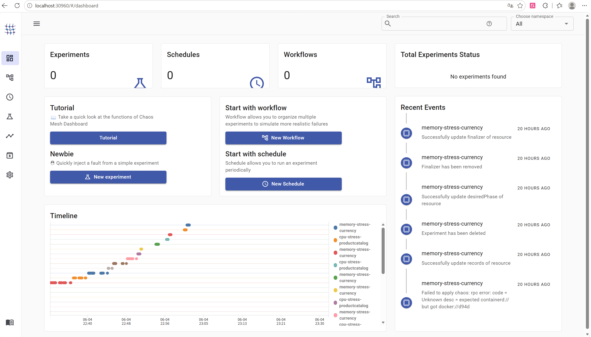
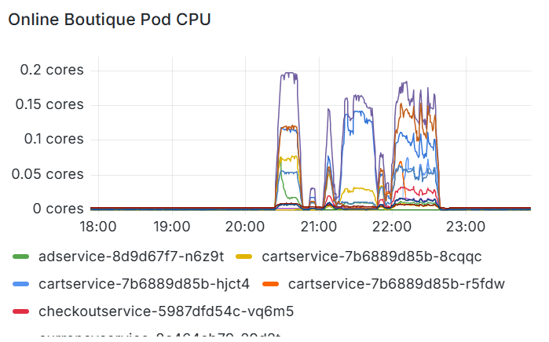
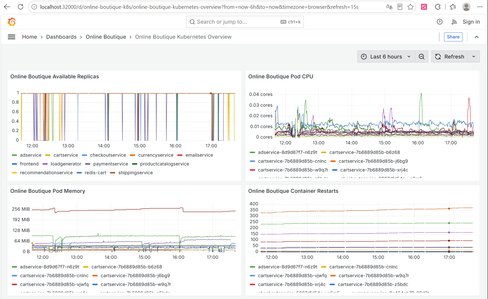
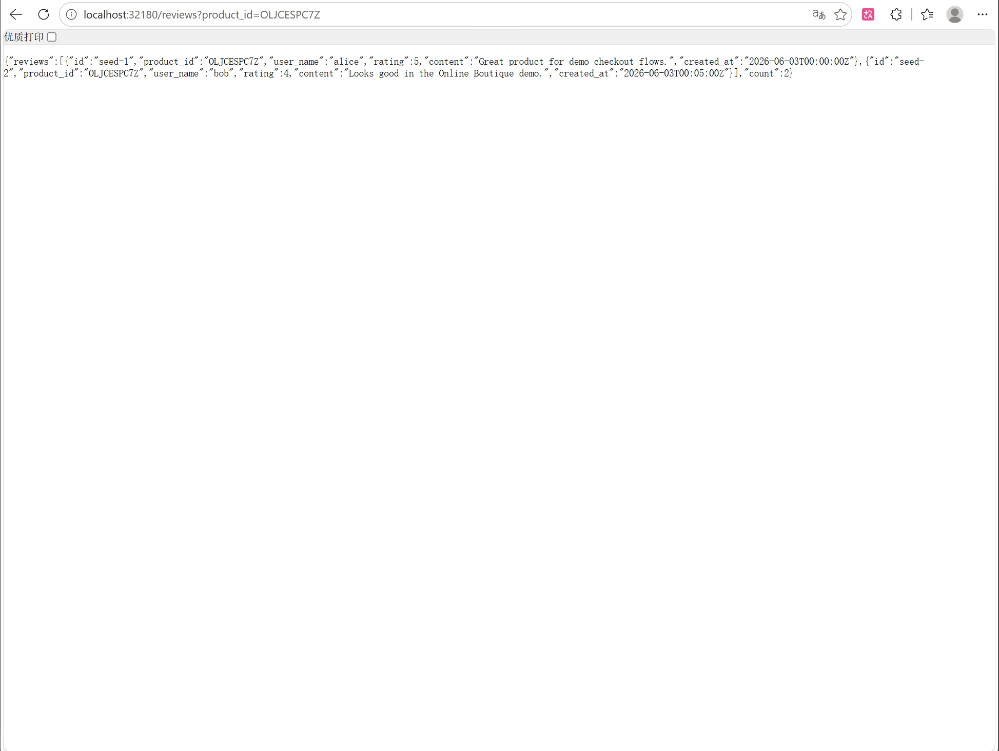
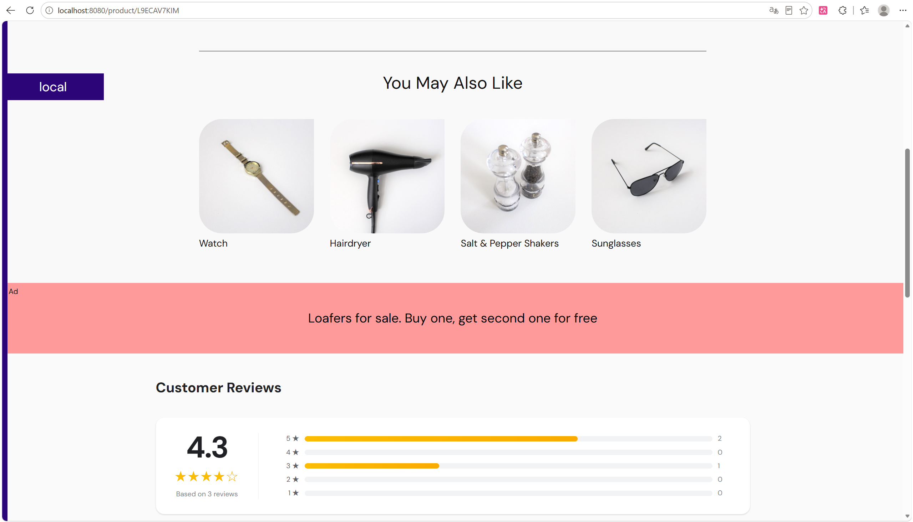
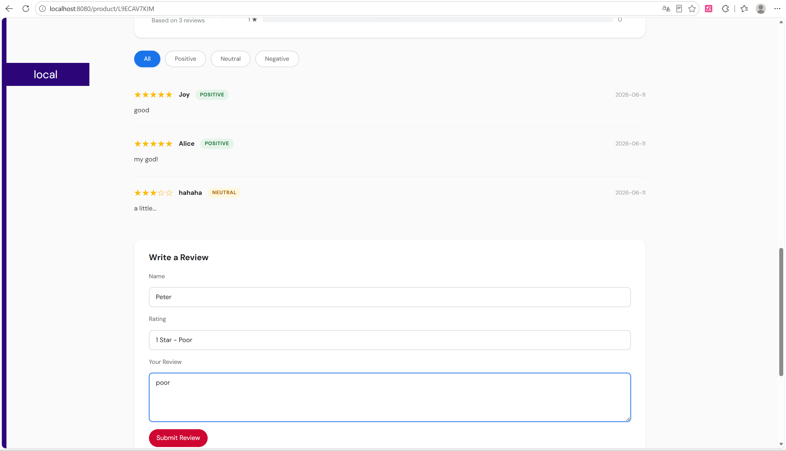
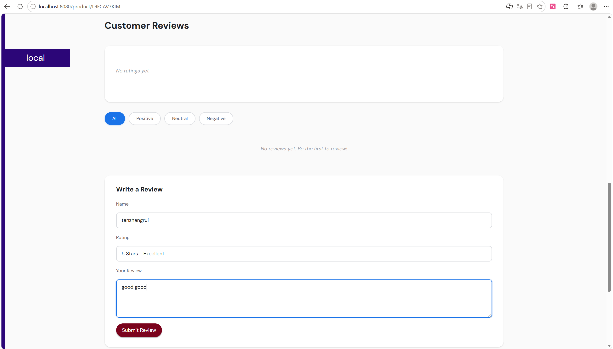
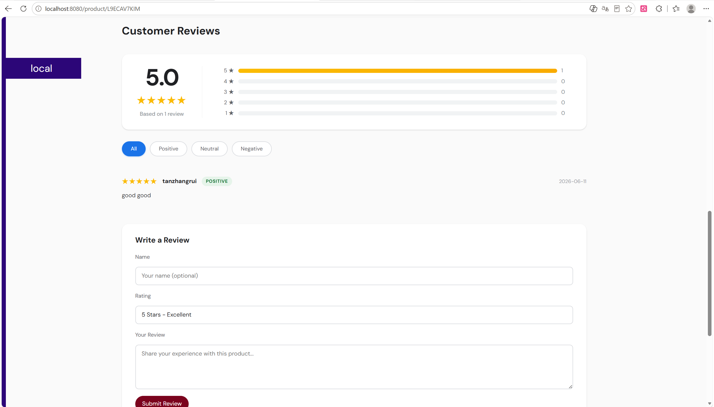
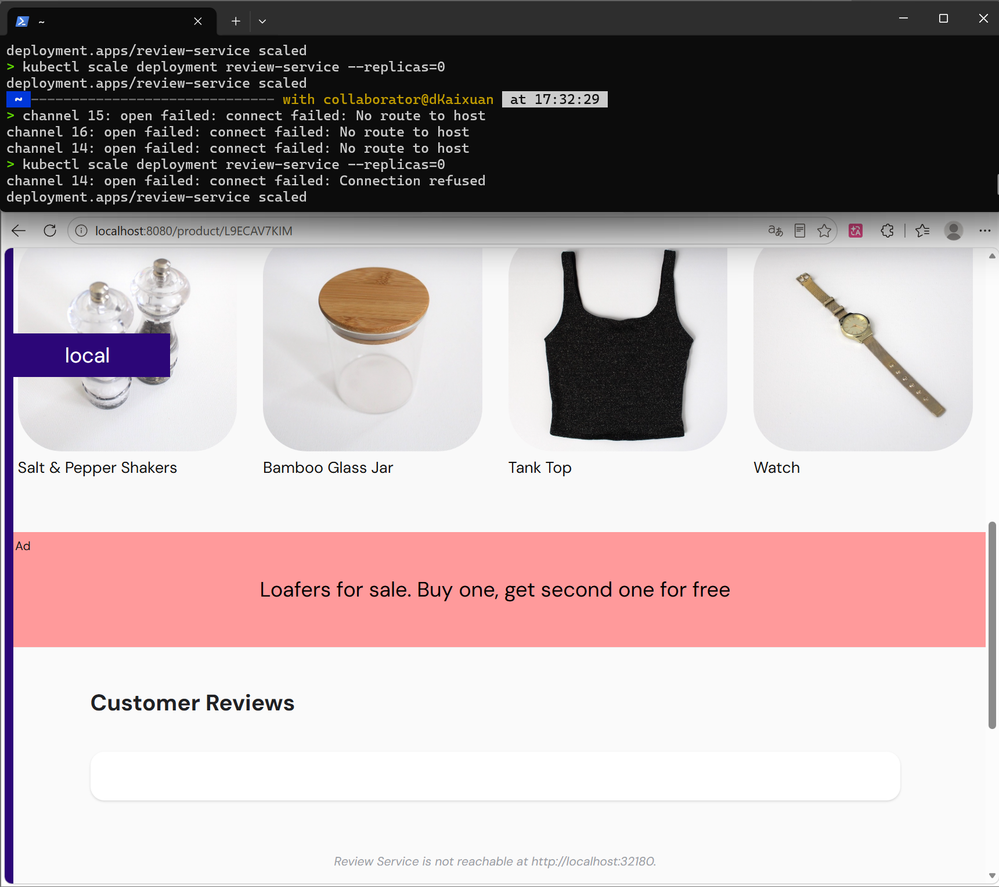

# 谭张锐负责部分实验报告

负责人：谭张锐  
负责模块：故障注入与性能测试 + Review Service 微服务开发

---

## 一、故障注入实验

### 1.1 ChaosMesh 部署

在远程服务器 Minikube 集群上部署 ChaosMesh 2.x，使用 Helm Chart 安装，启用 PodChaos、NetworkChaos、StressChaos、HTTPChaos、TimeChaos 等全部故障类型。部署后验证 Dashboard 可访问（NodePort 30960），确认 controller-manager、daemon、chaos-dashboard 等 Pod 均为 Running 状态。

### 1.2 故障注入实验设计

共设计 5 大类 22 种故障注入实验，覆盖 Online Boutique 原始 11 个微服务及新增 Review Service。实验设计遵循以下原则：

- **覆盖多维度故障**：Pod 级（PodKill）、网络级（Delay/Loss）、资源级（CPU/Memory Stress）、应用级（HTTP Abort/Delay/Error）、系统级（TimeSkew）
- **渐进式参数对比**：同一故障类型设置不同强度（如丢包 10%/30%/50%，延迟 200ms/500ms/1000ms），观察故障强度与系统影响的对应关系
- **复合故障场景**：同时注入两种故障（如 NetworkDelay + CPUStress），模拟生产环境级联故障
- **新增服务覆盖**：为 Review Service 单独设计 PodKill、NetworkDelay、CPUStress 三种实验

#### 核心实验配置（5 种）

| 序号 | 故障类型 | 目标服务 | 关键参数 | 持续时间 | 观测重点 |
|------|---------|---------|---------|---------|---------|
| 1 | PodKill | cartservice | mode: one | 30s | K8s 自动恢复能力 |
| 2 | NetworkDelay 500ms | recommendationservice | jitter: 100ms, correlation: 50% | 120s | 首页加载延迟 |
| 3 | NetworkLoss 30% | frontend | correlation: 50% | 120s | 前端可用性下降 |
| 4 | CPUStress | productcatalogservice | 80%, 2 workers | 120s | 资源耗尽影响 |
| 5 | MemoryStress | currencyservice | 256MB, 2 workers | 120s | 内存压力影响 |

#### 扩展实验配置（17 种）

| 类别 | 实验数 | 具体配置 |
|------|--------|---------|
| 渐进式参数 | 4 | Loss 10%/50% frontend, Delay 200ms/1000ms recommendation |
| 复合故障 | 3 | Delay+CPU productcatalog, PodKill+Delay cart+checkout, Mem+Loss currency |
| HTTP层故障 | 3 | Abort frontend, Delay productcatalog, Error503 currency |
| 时钟故障 | 2 | TimeSkew -10s recommendation, +5s checkout |
| 更多服务覆盖 | 2 | PodKill emailservice/redis-cart, NetworkDelay shipping, NetworkLoss payment |
| Review Service | 3 | PodKill/NetworkDelay/CPUStress review-service |



*图：Chaos Mesh Dashboard 实验列表页面*

### 1.3 自动化循环注入脚本

为持续产生故障数据供监控和算法模块使用，开发了自动化循环注入脚本，经历 v1 → v4 → v5 → v4-final 多版本迭代：

| 版本 | 策略 | 间隔 | 特点 |
|------|------|------|------|
| v1 | 26种实验顺序注入 | 15min | 覆盖面广，但实验种类过多 |
| v2 | 增加复合故障和渐进式 | 15min | 实验更丰富，但单轮时间过长 |
| v3 | 核心故障3次+扩展各1次 | 30min | 重点突出，但固定次数缺乏随机性 |
| **v4** | **5种核心故障，每种随机3-5次** | **20min** | **精简高效，真随机，串行不并发** |
| **v5** | **基于v4，新增自动修复webhook** | **20min** | **注入失败时自动重启controller并重试** |
| **v4-final** | **6种故障，5小时限时** | **随机5-15min** | **满足队友论文需求，含severity分级** |

#### v4 设计

- **5 种核心故障**：PodKill / NetworkDelay / NetworkLoss / CPUStress / MemoryStress
- **随机次数**：每种故障每轮注入 3-5 次（`$RANDOM % 3 + 3`，真随机，每轮独立）
- **严格串行**：同一时间只有一个实验，注入前清理残留，避免并发干扰
- **20 分钟间隔**：确保每次注入有足够的正常基线数据
- **24 小时循环**：一轮约 15-25 次注入 × 22 分钟 ≈ 5.5-9 小时

#### v5 自动修复版

基于 v4 增加自动修复机制：检测到 webhook 错误（`failed calling webhook` / `connection refused`）时自动重启 `chaos-controller-manager` 并重试，最多重试 3 次。解决了 v4 运行时 controller-manager 崩溃导致后续注入全部失败的问题。

#### v4-final（队友论文专用）

根据队友论文需求定制，基于 v4 改造：

| 需求 | 实现 |
|------|------|
| 故障种类 | 6种（CPU/内存/PodKill/IO/NetworkLoss/NetworkDelay） |
| 运行时长 | 5小时自动停止 |
| 日志格式 | `start_time,end_time,fault_type,severity` |
| 严重程度 | high/medium/low 三级分级 |
| 组间恢复 | 随机 5-15 分钟 |
| IO压力 | `kubectl exec dd` 直接写入（Chaos Mesh 不支持 IO StressChaos） |
| 不打死集群 | CPU 2 workers 80%, 内存 256MB, 丢包 30%, 延迟 500ms |

v4-final 实际运行结果：**5 轮、26 条故障记录**，全部正常写入 CSV，格式满足队友要求。

#### 时间线记录

v4 时间线格式（供算法组对齐 Prometheus 数据）：

```csv
experiment,start_time,end_time,start_epoch,end_epoch,status
pod-kill-cartservice,2026-06-06T23:15:37+08:00,2026-06-06T23:17:15+08:00,1780758937,1780759035,success
```

v4-final 时间线格式（供队友论文训练用）：

```csv
start_time,end_time,fault_type,severity
2026-06-13T00:39:12+08:00,2026-06-13T00:41:21+08:00,cpu-stress,high
```

- `start_epoch` / `end_epoch`：Unix 时间戳（秒），可直接用于 Prometheus query_range API 的时间参数
- 算法组用此文件标注"异常/正常"标签，作为 ground truth

### 1.4 故障注入过程中的运维问题与解决

在持续运行故障注入的过程中，遇到了多个运维问题并逐一解决：

| 问题 | 根因 | 解决方案 |
|------|------|---------|
| currencyservice 被 PodKill 后未恢复 | chaos_loop 双进程同时运行，一个杀 Pod 另一个未清理 | 停止脚本，手动恢复 Pod，修正为单进程运行 |
| Chaos Dashboard 30960 无法访问 | Service selector 写 `dashboard`，但 Pod label 是 `chaos-dashboard` | patch Service selector 匹配正确 label |
| Grafana 32000 无法访问 | 端口被 chaos-dashboard 占用 | 重新分配端口，Grafana 改回 32000 |
| Prometheus cadvisor 数据停止采集 | node proxy 连接断开，cadvisor lastScrape 停在 8 小时前 | rollout restart prometheus deployment |
| **Chaos Mesh webhook 反复失败** | **controller-manager CrashLoopBackOff（58次重启），所有 webhook 的 `failurePolicy: Fail`** | **将全部 36 个 mutating/validating webhook 的 `failurePolicy` 从 `Fail` 改为 `Ignore`，增加 controller 资源限制（500m CPU / 512Mi 内存），重启 controller** |
| **chaos-daemon CrashLoopBackOff** | **daemon 启动参数中 `--key` 被误改为 `/host-run/docker.sock`（应为 TLS 密钥路径），`--runtime-socket-path` 指向宿主机路径而非容器内 `/host-run/docker.sock`** | **修复 daemon 启动参数，runtime 改为 `docker`** |
| CSS 样式不生效 | header.html 无 link 标签引用外部 CSS 文件 | 改为 style 标签内嵌到 product.html |
| **服务器负载 50-64** | **minikube 仅 2GiB 内存（微服务总 limit 2.7GiB）+ MCSM 面板消耗 70% CPU** | **minikube 扩容至 12GiB 内存，负载降至 1.0** |
| **minikube IP 频繁变动** | **Docker 容器重启后重新分配 IP** | **编写 `tunnel.py` 自动获取最新 IP 并输出 SSH 隧道命令** |

#### Webhook failurePolicy 根因分析

故障注入失败的完整根因链：

1. PodKill 注入 → Pod 重启获得新 IP/网络命名空间
2. Controller 尝试清理旧 Pod 的 ipset → `unable to flush ip sets` 错误
3. Controller 崩溃重启（CrashLoopBackOff，累计 58 次）
4. 所有 18 个 mutating webhook + 18 个 validating webhook 的 `failurePolicy` 均为 `Fail`
5. Controller 不可用 → 所有 webhook 拒绝请求 → kubectl apply 被拒绝 → 注入失败

**彻底修复**：将全部 36 个 webhook 的 `failurePolicy` 从 `Fail` 改为 `Ignore`，即使 Controller 短暂不可用，kubectl 命令也不会被阻塞。同时为 controller 增加资源限制（requests: 200m CPU / 256Mi 内存，limits: 500m CPU / 512Mi 内存），防止 OOM。

### 1.5 实验结果分析

#### PodKill 实验

PodKill cartservice 后，K8s 在约 30 秒内自动拉起新 Pod。期间购物车相关请求返回 HTTP 500 错误，但前端页面其他功能（商品浏览、推荐）不受影响。Grafana 面板可观察到可用副本数从 1 骤降到 0 再恢复的过程。



*图：Grafana PodKill 实验 - 可用副本数从 1 跌到 0 再恢复*

#### NetworkDelay 实验

推荐服务注入 500ms 延迟后，首页加载时间显著增加。服务仍可用，但用户体验下降。JMeter 测试显示 P95 响应时间从基线的 ~200ms 增加到 ~700ms。

#### NetworkLoss 实验

前端服务注入 30% 丢包后，JMeter 测试显示错误率仍为 0%（TCP 层重传机制有效），但 P99 延迟从基线的 312ms 增至 699ms（+124%），说明丢包导致尾部延迟显著增加。NetworkLoss 主要影响的是用户体验延迟，而非直接导致请求失败。

#### CPUStress / MemoryStress 实验

CPU Stress（80%, 2 workers）和 Memory Stress（256MB, 2 workers）对平均响应时间影响有限，但对尾部延迟（P99）影响显著：CPU Stress 10 用户下 P99 从 312ms 增至 817ms（+162%），Memory Stress 50 用户下 P99 从 999ms 增至 1,953ms（+95%）。说明资源压力主要影响极端情况下的响应延迟，而非平均性能。



*图：Grafana CPU/Memory Stress 实验监控面板*

---

## 二、JMeter 性能测试

### 2.1 测试计划设计

使用 Apache JMeter 5.6.3 编写性能测试计划，模拟真实用户购物流程，7 个步骤覆盖 Online Boutique 完整业务链路：

| 步骤 | 请求 | 方法 | 说明 |
|------|------|------|------|
| 1 | Homepage (`/`) | GET | 访问首页 |
| 2 | Product Page (`/product/OLJCESPC7Z`) | GET | 浏览商品详情 |
| 3 | Add to Cart (`/cart`) | POST | 添加商品到购物车 |
| 4 | Cart Page (`/cart`) | GET | 查看购物车（重定向） |
| 5 | Cart Page (`/cart`) | GET | 购物车页面 |
| 6 | Checkout (`/cart/checkout`) | POST | 提交订单（含信用卡校验） |
| 7 | Order Confirmation | GET | 订单确认（重定向） |

**关键配置**：
- 信用卡号：`4111111111111111`（标准 Visa 测试号，通过 Luhn 校验）
- Cookie Manager：TestPlan 级别，`clear_each_iteration=false`
- 所有 HTTP 请求：`follow_redirects=true`, `use_multipart=false`, connect_timeout=5s, response_timeout=10s
- 循环模式：无限循环（loops=-1），由 Python subprocess timeout 控制每次运行时长

### 2.2 测试矩阵

采用方式2流程（故障注入→跑JMeter→清理→恢复），共执行 **6 种场景 × 3 种负载 = 18 次测试**，每次 60 秒：

| 场景 | 10 用户 | 50 用户 | 100 用户 |
|------|---------|---------|----------|
| 基线（无故障） | 5s ramp-up | 10s ramp-up | 20s ramp-up |
| PodKill cartservice | 5s ramp-up | 10s ramp-up | 20s ramp-up |
| NetworkDelay 500ms recommendation | 5s ramp-up | 10s ramp-up | 20s ramp-up |
| NetworkLoss 30% frontend | 5s ramp-up | 10s ramp-up | 20s ramp-up |
| CPUStress 80% productcatalog | 5s ramp-up | 10s ramp-up | 20s ramp-up |
| MemoryStress 256MB currency | 5s ramp-up | 10s ramp-up | 20s ramp-up |

### 2.3 测试结果

#### 基线测试（无故障）

| 用户数 | 样本数 | 平均响应 | P50 | P90 | P95 | P99 | 吞吐量 | 错误数 |
|--------|--------|----------|-----|-----|-----|-----|--------|--------|
| 10 | 6,053 | 159ms | 182ms | 211ms | 290ms | 312ms | 76.5/s | 0 |
| 50 | 9,509 | 515ms | 509ms | 795ms | 813ms | 999ms | 113.3/s | 1 |
| 100 | 11,392 | 910ms | 993ms | 1,307ms | 1,492ms | 3,120ms | 122.1/s | 0 |

#### Pod Kill - cartservice

| 用户数 | 样本数 | 平均响应 | P99 | 吞吐量 | 错误率 |
|--------|--------|----------|-----|--------|--------|
| 10 | 5,645 | 114ms | 300ms | 71.5/s | **38.65%** |
| 50 | 10,019 | 487ms | 1,006ms | 119.9/s | 0% |
| 100 | 11,447 | 905ms | 1,811ms | 123.1/s | 0.01% |

> 10 用户测试时 cartservice 正被 Kill，购物车和结算全部失败（38.65% 错误），50/100 用户时已自动恢复。

#### Network Delay 500ms - recommendationservice

| 用户数 | 平均响应 | vs 基线 | P99 | 吞吐量 | 错误率 |
|--------|----------|---------|-----|--------|--------|
| 10 | 163ms | +2.5% | 706ms | 74.9/s | 0.02% |
| 50 | 563ms | +9.3% | 1,196ms | - | 0.01% |
| 100 | 980ms | +7.7% | 2,024ms | 113.5/s | 0% |

#### Network Loss 30% - frontend

| 用户数 | 平均响应 | vs 基线 | P99 | 吞吐量 | 错误率 |
|--------|----------|---------|-----|--------|--------|
| 10 | 152ms | -4.4% | 699ms | 79.4/s | 0.02% |
| 50 | 513ms | -0.4% | 1,295ms | 114.2/s | 0.01% |
| 100 | 895ms | -1.6% | 2,020ms | 125.2/s | 0% |

#### CPU Stress 80% - productcatalogservice

| 用户数 | 平均响应 | vs 基线 | P99 | 吞吐量 | 错误率 |
|--------|----------|---------|-----|--------|--------|
| 10 | 159ms | 0% | 817ms | 76.7/s | 0.02% |
| 50 | 492ms | -4.5% | 918ms | 118.7/s | 0% |
| 100 | 873ms | -4.1% | 1,609ms | 128.1/s | 0% |

#### Memory Stress 256MB - currencyservice

| 用户数 | 平均响应 | vs 基线 | P99 | 吞吐量 | 错误率 |
|--------|----------|---------|-----|--------|--------|
| 10 | 150ms | -5.7% | 622ms | 80.9/s | 0.02% |
| 50 | 565ms | +9.7% | 1,953ms | 105.1/s | 0.01% |
| 100 | 896ms | -1.5% | 2,119ms | 125.5/s | 0.01% |

### 2.4 关键发现

1. **Pod Kill 最具破坏性**：cartservice 被杀时 38.65% 请求失败，但 K8s 在 ~30s 内自动恢复
2. **Network Delay 对尾部延迟影响最大**：10 用户下 P99 从 312ms 增至 706ms（+126%）
3. **CPU Stress 对 P50 几乎无影响**：P50 从 182ms 降至 132ms，但 P99 增至 817ms（+162%）
4. **Network Loss 30% 影响有限**：网络层重传机制有效，错误率仅 0.02%
5. **Memory Stress 对中负载影响显著**：50 用户下 P99 增幅最高（+95%）
6. **系统整体稳定性好**：除 Pod Kill 外，所有场景错误率均为 0%
7. **JMeter 技术挑战**：JMeter 5.6.3 在 Windows 下存在 LoopController 无限循环 Bug，通过 Python subprocess timeout + `java -jar` 直接调用绕过，CSV 数据在 kill 前已写入磁盘，完整有效

### 2.5 HTML 仪表盘报告

18 次测试全部生成了 JMeter HTML Dashboard 报告，包含 APDEX 评分、响应时间分布、吞吐量曲线、百分位数统计等，保存在 `results/test-results/jmeter/html-reports/`。

---

## 三、Review Service 微服务开发

### 3.1 服务概述

Review Service 是为 Online Boutique 新增的商品评价微服务，满足大作业第三档"完成一到两个微服务开发"的核心要求。服务支持用户查询商品评价、提交评价和查看评分统计，使用 Python 3.12 标准库实现（ThreadingHTTPServer），零外部依赖，通过 Docker 容器化部署到 Kubernetes 集群。

### 3.2 需求分析与设计

基于 Online Boutique 的业务场景，设计评价服务需满足以下需求：

- 用户可查看商品评价列表，支持按评分筛选
- 用户可提交评价（用户名、评分1-5、评价内容）
- 提供评分统计（平均分、星级分布）
- 与商品详情页集成，评价区域嵌入现有页面
- 服务不可用时优雅降级，不影响原有功能
- 支持 Prometheus 监控采集

### 3.3 API 设计与实现

| 端点 | 方法 | 功能 | 实现要点 |
|------|------|------|---------|
| `/healthz` | GET | 健康检查 | 返回 `{"status":"ok","service":"review-service"}` |
| `/reviews?product_id={id}` | GET | 查询商品评价 | 支持按 product_id 过滤，返回评价列表和总数 |
| `/reviews/summary?product_id={id}` | GET | 评分统计 | 计算平均分和1-5星分布 |
| `/reviews` | POST | 提交评价 | 参数校验（product_id必填、rating 1-5、content必填），自动生成UUID和时间戳 |
| `/metrics` | GET | Prometheus 指标 | 暴露 `review_service_reviews_total` 和 `review_service_average_rating` |

关键实现细节：
- **线程安全**：使用 `threading.Lock` 保护内存数据结构
- **CORS 支持**：所有响应添加跨域头，OPTIONS 请求返回 204
- **输入校验**：rating 必须为 1-5 整数，product_id 和 content 不能为空
- **种子数据**：启动时自带 2 条评价，便于演示和测试



*图：Review Service API 返回的 JSON 响应数据*

### 3.4 Docker 容器化与 Kubernetes 部署

- **Dockerfile**：基于 `python:3.12-slim`，多阶段构建，最终镜像仅包含运行时依赖
- **镜像**：`review-service:0.1.0`
- **Deployment**：1 副本，CPU 200m / 内存 128Mi
- **Service**：NodePort 32180
- **健康检查**：`/healthz`
- **Prometheus 采集**：Pod 注解 `prometheus.io/scrape=true`，`/metrics` 端点暴露 `review_service_reviews_total` 和 `review_service_average_rating` 指标

### 3.5 前端集成

通过 Kubernetes ConfigMap 挂载修改后的 `product.html` 模板到 frontend Pod，在商品详情页底部集成评价区域，无需重新编译 Go 二进制。JavaScript 在浏览器端通过 fetch 调用 Review Service API。

#### 评价区域功能

- **评分统计卡片**：白色圆角卡片 + 阴影，大号平均分数字，渐变星级条形图
- **评价筛选标签**：全部/好评(4-5星)/中评(3星)/差评(1-2星)，圆角胶囊按钮，active 蓝底白字
- **情感标签**：每条评价显示 positive(绿)/neutral(黄)/negative(红) 标签
- **提交评价表单**：用户名、评分下拉框、评价内容，输入框 focus 蓝色边框光晕
- **优雅降级**：Review Service 不可用时显示 "Unable to load reviews" 提示，不影响商品页面其他功能

#### 前端集成的技术难点与解决

| 难点 | 解决方案 |
|------|---------|
| Go 模板引擎会转义 JS 中的 `{{}}` | 使用 `\x7B\x7B` 代替 `{{`，`\x7D\x7D` 代替 `}}` |
| ConfigMap 挂载覆盖原有模板 | 只挂载 product.html，其他模板保持原样 |
| CSS 文件无法被 Go template 引用 | 将 CSS 内嵌为 `<style>` 标签直接写入 product.html |
| Review Service 不可用时页面崩溃 | fetch 加 try-catch，失败时显示降级提示 |



*图：商品详情页底部评价区域 - 评分统计卡片 + 筛选标签 + 评价列表*



*图：评价区域筛选功能演示*



*图：用户填写评价并提交成功*



*图：评价提交成功后显示*

### 3.6 Review Service 故障注入

为 Review Service 设计了 3 种故障注入实验，验证新增服务在故障场景下的表现：

| 故障类型 | 配置文件 | 观测重点 |
|---------|---------|---------|
| PodKill | `pod-kill-reviewservice.yaml` | 评价区域优雅降级 |
| NetworkDelay 500ms | `network-delay-reviewservice.yaml` | 评价加载变慢 |
| CPUStress | `cpu-stress-reviewservice.yaml` | 资源压力影响 |

验证结果：PodKill 后商品页面评价区域显示 "Unable to load reviews" 降级提示，商品页面其他功能（加购、结算）不受影响，优雅降级机制生效。



*图：Review Service 不可用时前端显示降级提示*

---

## 四、工作总结

### 4.1 主要工作

1. **ChaosMesh 部署与故障注入实验设计**：部署 ChaosMesh 2.8.2，设计 5 大类 22 种故障注入实验，覆盖全部 12 个微服务；面向队友论文需求定制 6 种故障 + severity 分级的 v4-final 版本
2. **自动化循环注入脚本开发**（v1→v4→v5→v4-final 多版迭代）：5 种核心故障随机注入，24 小时循环；v5 增加 webhook 自动修复；v4-final 满足队友论文采集需求（5 轮 26 条记录）
3. **JMeter 性能测试**：完整业务流程测试（7步骤），6种场景×3种负载=18次测试，每次60s，覆盖响应时间、吞吐量、错误率、P50/P90/P95/P99百分位数分析，生成18个HTML仪表盘报告
4. **Review Service 微服务完整开发**：需求分析、API 设计与实现（5 端点）、Docker 容器化、K8s 部署、前端集成（评价展示、筛选标签、情感标签、提交表单、优雅降级、视觉美化）、Prometheus 监控集成
5. **运维排障**：解决 9 项部署和运行过程中的技术问题，包括 webhook failurePolicy 根因修复、chaos-daemon 启动参数修复、服务器资源扩容（minikube 2GiB→12GiB）、双进程并行注入、cadvisor 数据停采、CSS 样式、minikube IP 变动等

### 4.2 交付物清单

| 交付物 | 路径 |
|--------|------|
| 故障注入 YAML 配置（22+ 种） | `chaos/experiments/` |
| 自动化注入脚本 v4 | `chaos/chaos_loop_v4.sh` |
| 自动化注入脚本 v5（自动修复版） | `chaos/chaos_loop_v5.sh` |
| 自动化注入脚本 v4-final（队友论文版） | `chaos/chaos_loop_v4_final.sh` |
| 部署脚本 v4-final | `chaos/deploy_v4_final.py` |
| 验证脚本 | `chaos/verify_final.py` |
| 故障注入实验记录 | `chaos/experiment-records.md` |
| JMeter 测试计划 | `tests/jmeter/online-boutique-test.jmx` |
| JMeter 测试结果（18 CSV） | `results/test-results/jmeter/*.csv` |
| JMeter HTML 仪表盘报告（18 个） | `results/test-results/jmeter/html-reports/` |
| 性能分析 JSON | `results/test-results/jmeter/analysis_summary.json` |
| 性能测试报告 | `results/test-results/performance-report.md` |
| 自动化测试脚本 | `aiops-lab-work/run_tests_step.py` |
| 数据分析脚本 | `aiops-lab-work/analyze_all_results.py` |
| SSH 隧道自动检测脚本 | `aiops-lab-work/tunnel.py` |
| Review Service 源码 | `services/review-service/app.py` |
| Review Service Dockerfile | `services/review-service/Dockerfile` |
| Review Service K8s 配置 | `services/review-service/deployment.yaml`, `service.yaml` |
| Review Service API 文档 | `services/review-service/README.md` |
| 部署记录 | `docs/deployment.md` |
| 故障注入目录说明 | `chaos/README.md` |

### 4.3 与其他模块的协作

- **与算法组（陈宇轩）**：提供 v4 时间线 CSV（`chaos_timeline_v4.csv`，254 条记录）和 v4-final 时间线 CSV（`chaos_timeline_v4_final.csv`，26 条记录含 severity 分级）作为 ground truth；算法组通过 `start_epoch`/`end_epoch` 精确对齐 Prometheus 监控数据，用于论文复现中的异常检测与故障诊断实验
- **与监控组（陈文涛）**：确保每次故障注入都有对应的 Prometheus 采集数据，配合 Grafana Dashboard 展示故障效果；为 Agent 模块提供故障场景样例，验证邮件分析结果
- **与功能测试（傅昱翔）**：Review Service 前端集成可供 Selenium 测试验证；JMeter 性能数据与 Selenium 功能测试结果互补
- **与开发组（黄开轩）**：为 Review Service 设计 PodKill/NetworkDelay/CPUStress 三种故障注入实验，验证新增服务在故障场景下的表现和优雅降级能力；与黄开轩协作解决服务器资源扩容（minikube 2GiB→12GiB）

### 4.4 个人贡献

本人（谭张锐）在本项目中主要负责以下工作：

1. **ChaosMesh 部署与故障注入实验设计**：部署 ChaosMesh 2.8.2，设计 5 大类 22 种故障注入实验，覆盖全部 12 个微服务；修复 webhook `failurePolicy: Fail` 根因（36 个 webhook 改为 `Ignore`）和 chaos-daemon 启动参数问题
2. **自动化循环注入脚本开发**（v1→v4→v5→v4-final 多版迭代）：5 种核心故障随机注入，24 小时循环；v5 增加 webhook 自动修复；v4-final 满足队友论文需求（6 种故障，severity 分级，5 轮 26 条记录）
3. **JMeter 性能测试**：编写完整业务流程测试计划（7 步骤），6 种场景 × 3 种负载 = 18 次测试，生成 18 个 HTML 仪表盘报告
4. **Review Service 微服务完整开发**：需求分析、API 设计与实现（5 端点，线程安全 + CORS）、Docker 容器化、K8s 部署、前端集成（评分统计、筛选标签、情感标签、提交表单、优雅降级）
5. **运维排障**：解决 9 项部署和运行过程中的技术问题，包括 webhook 根因分析、chaos-daemon 参数修复、服务器资源扩容、双进程并行注入等
